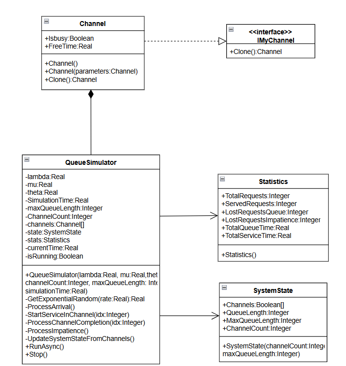
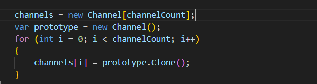
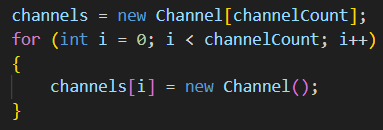

# Отчет о проделанной работе

## 1. Цель работы
Модернизировать СМО, добавив создание обслуживающих каналов при помощи паттерна прототип.

## 2. Диаграмма классов для паттерна

Класс Channel реализует интерфейс IMyChannel . QueueSimulator создает объект прототип и заполняет массив его клонами.

## 3. Реализация без паттерна

В реализации без паттерна был убран интерфейс, а создание каналов происходит прямым вызовом  new Channel
в цикле

## 4. Вывод
Для данной СМО с данной математической моделью использование паттерна избытычно, так как каналы имеют всего 2 поля и
являются одинаковыми. Поэтому можно и обойтись без него.
Но если бы потребовалось создание разный каналов с разной структурой, то тогда лучше было бы использовать прототип.

