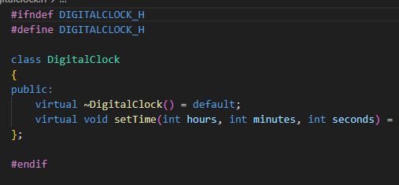
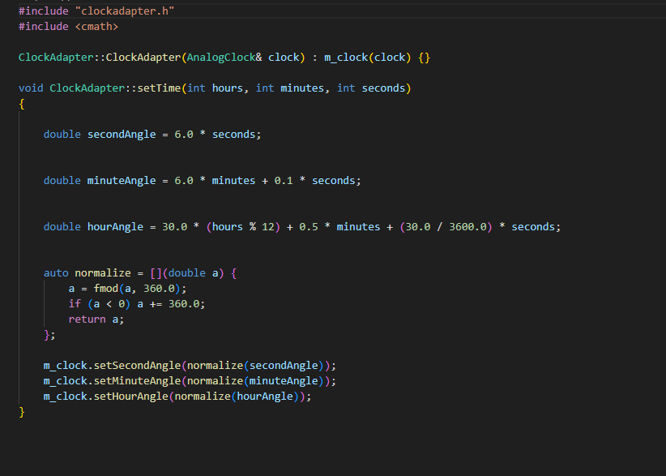
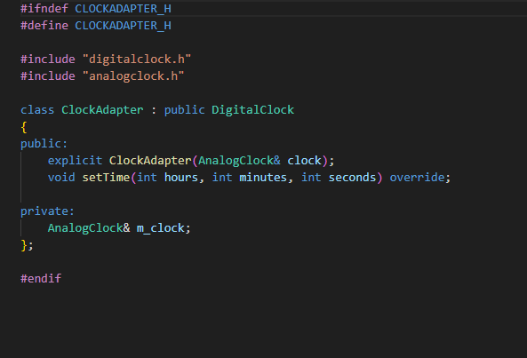
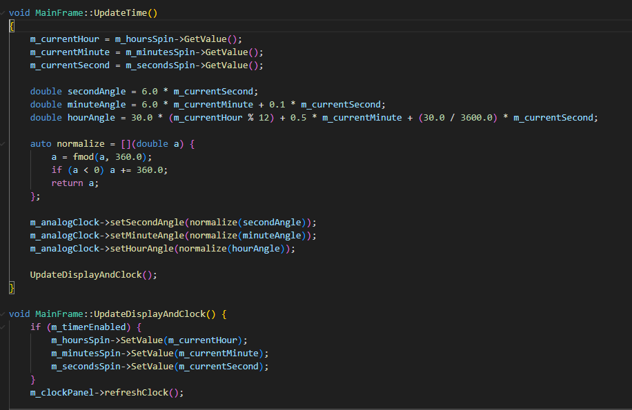
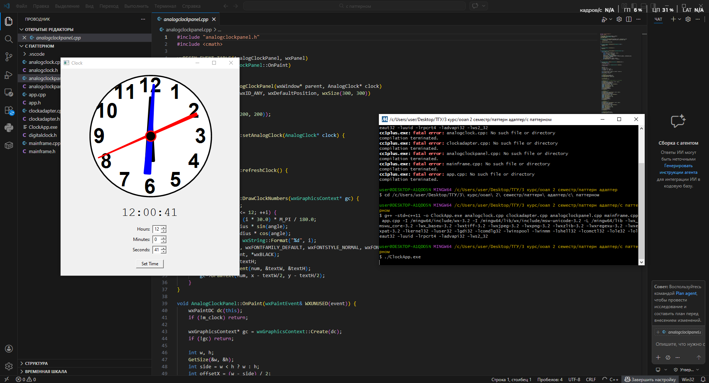

# Отчет о проделанной работе

## 1. Цель работы
Реализовать проект, который преобразует время, введенное в цифровых часах, во время, выводимое на аналоговые часы.

## 2. Диаграмма классов для паттерна

AnalogClock хранит углы поворота стрелок и предоставляет методы setHourAngle, setMinuteAngle, setSecondAngle\
Цифровой интерфейс  — DigitalClock с единственным методом setTime(int hours, int minutes, int seconds), который ожидает клиент (главное окно MainFrame)

Адаптируемый класс – AnalogClock\
Целевой интерфейс – DigitalClock

Адаптер – ClockAdapter, который наследует DigitalClock и содержит ссылку на AnalogClock. В методе setTime он вычисляет углы по заданному времени и вызывает соответствующие методы AnalogClock

Реализация Digital Clock

Реализация ClockAdapter

## 3. Реализация без паттерна

Чтобы написать программу без паттерна, все методы по вычислениям углов были перенесены в mainframe

## 4. Результат
В конце получились такие часы

