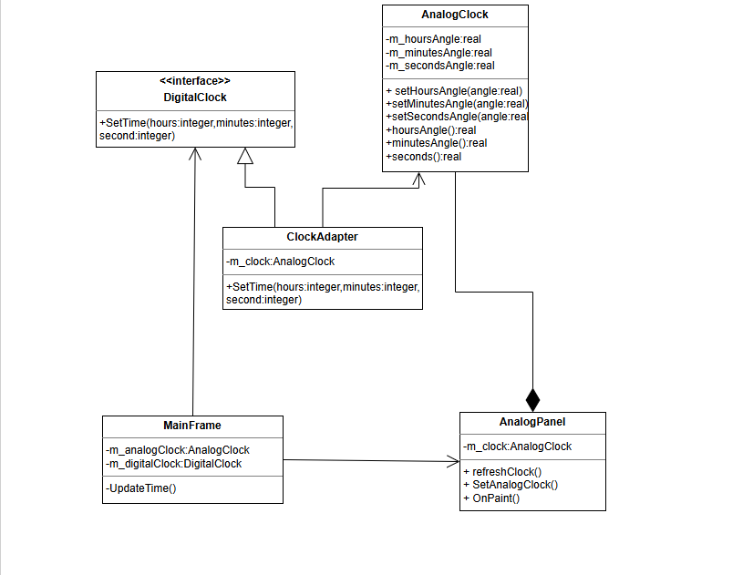

# Отчет о проделанной работе

## 1. Цель работы
Реализовать проект, который преобразует время, введенное в цифровых часах, во время, выводимое на аналоговые часы.

## 2. Диаграмма классов для паттерна

AnalogClock хранит углы поворота стрелок и предоставляет методы setHourAngle, setMinuteAngle, setSecondAngle\
Цифровой интерфейс  — DigitalClock с единственным методом setTime(int hours, int minutes, int seconds), который ожидает клиент (главное окно MainFrame)

Адаптируемый класс – AnalogClock\
Целевой интерфейс – DigitalClock

Адаптер – ClockAdapter, который наследует DigitalClock и содержит ссылку на AnalogClock. В методе setTime он вычисляет углы по заданному времени и вызывает соответствующие методы AnalogClock

## 3. Реализация без паттерна

В реализации без паттерна был убран интерфейс, а создание каналов происходит прямым вызовом  new Channel
в цикле

## 4. Вывод
Для данной СМО с данной математической моделью использование паттерна избытычно, так как каналы имеют всего 2 поля и
являются одинаковыми. Поэтому можно и обойтись без него.
Но если бы потребовалось создание разный каналов с разной структурой, то тогда лучше было бы использовать прототип.
