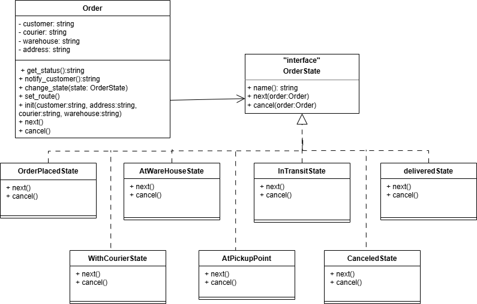
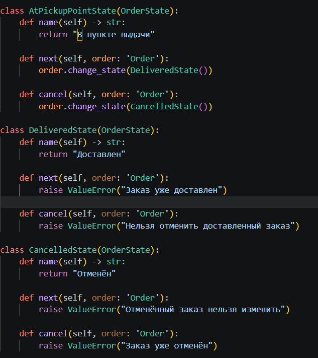
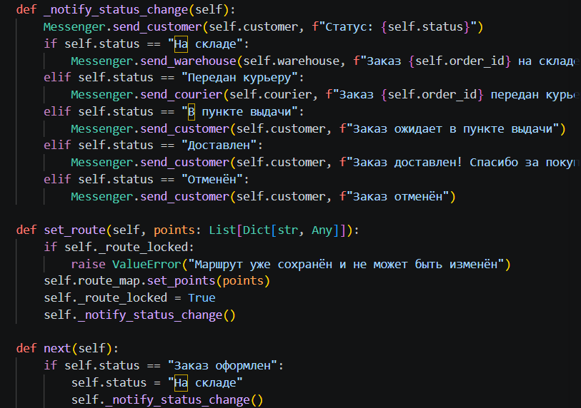

# Отчет о проделанной работе

## 1. Цель работы
Реализовать проект, который показывает статус доставки.

## 2. Диаграмма классов для паттерна

OrderPlaced: уведомление покупателю о создании заказа.

AtWarehouse: уведомление складу и покупателю о прибытии на склад.

WithCourier: уведомление курьеру и покупателю о передаче заказа.

InTransit: уведомление курьеру о начале движения; при каждом прибытии в промежуточную точку – уведомление покупателю.

AtPickupPoint: уведомление покупателю о готовности к выдаче.

Delivered: уведомление покупателю об успешной доставке.

Cancelled: уведомление покупателю об отмене.

## 3. Диаграмма состояний для паттерна

## 4. Реализация паттерна

## 5. Без паттерна

## 6. Результат

