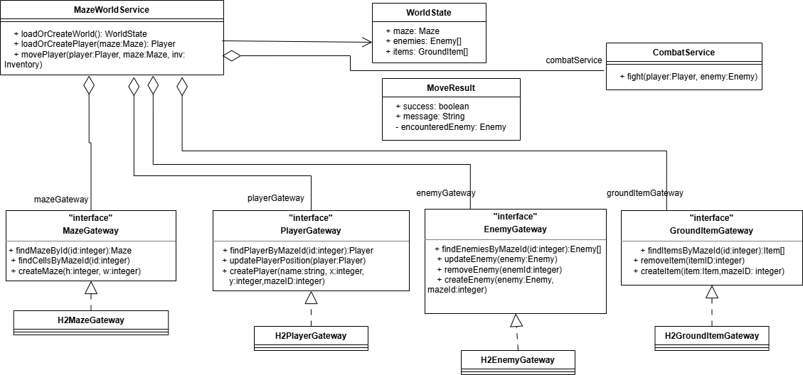
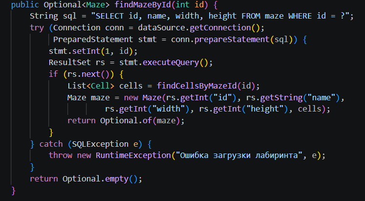
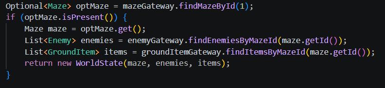
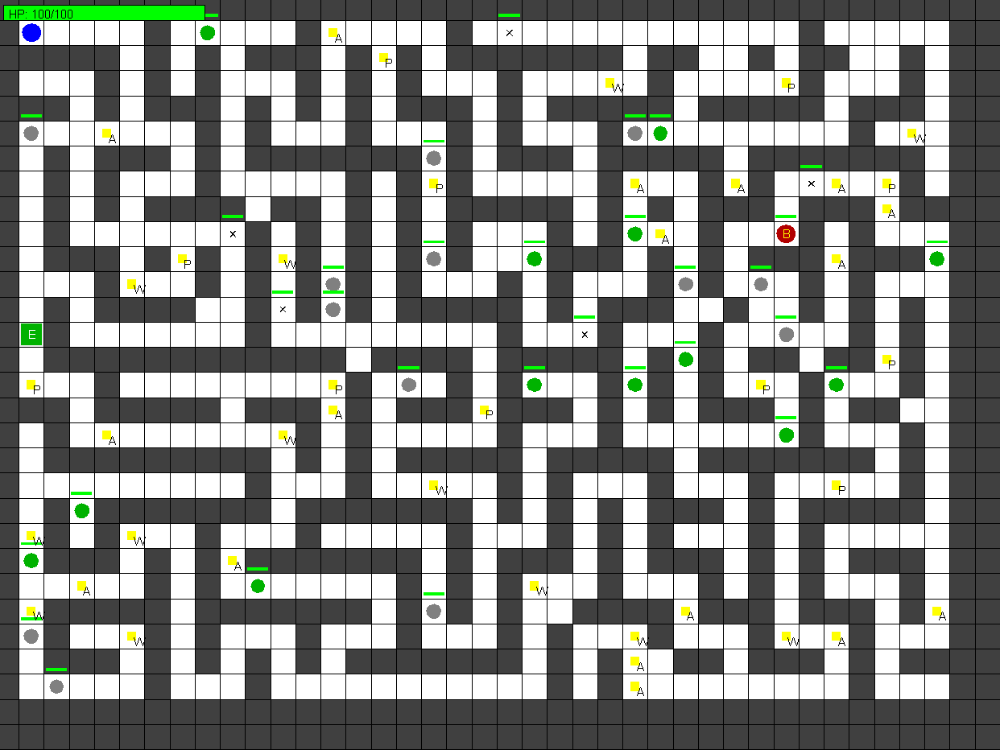

#  Паттерн «Gateway» для простой игровой механики похода по лабиринту

## Описание проблемы

Проект представляет собой 2D‑игру в жанре Roguelike с графическим интерфейсом на Swing.
Игрок перемещается по случайно генерируемому лабиринту, сражается с врагами (включая боссов), собирает предметы и экипировку, использует боевые умения, а также ищет ключ от выхода, чтобы покинуть лабиринт.
Особенностью проекта является постоянное состояние игрового мира – все данные (лабиринт, положение игрока, враги, предметы, инвентарь) сохраняются в реляционной базе данных H2 в файловом режиме.
При повторном запуске игры прогресс полностью восстанавливается.

**Роли:**

Интерфейсы (MazeGateway, PlayerGateway, EnemyGateway, GroundItemGateway)
Каждый интерфейс предоставляет набор операций: поиск, создание, обновление, удаление сущностей. Они не содержат никакой информации о SQL.

Реализации для H2 (H2MazeGateway, H2PlayerGateway, H2EnemyGateway, H2GroundItemGateway)
Это классы, которые реализуют соответствующие интерфейсы и содержат прямые SQL‑запросы для  управления соединениями.

MazeWorldService – центральное ядро мира. Отвечает за загрузку/создание лабиринта, перемещение игрока, обработку встреч с врагами и предметами. .

CombatService – боевая механика. Использует EnemyGateway для удаления врага

---

## Взаимодействие

---

## Влияние внедрения паттерна
Весь SQL‑код и управление подключениями скрыты в реализациях шлюзов. Сервисы и GUI не засорены и не показывают внутреннюю реализацию.

Чтобы перейти с H2 на PostgreSQL (или любую другую БД), достаточно написать новые реализации интерфейсов шлюзов. Бизнес‑логика и интерфейс останутся без изменений.

Сервисы можно тестировать с заглушками  интерфейсов шлюзов, не поднимая  базу данных.

---

## Итог

